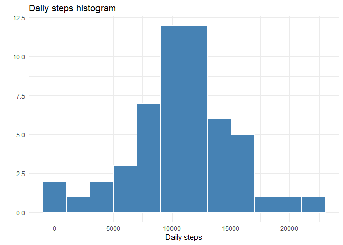

## Loading and preprocessing the data

### Load the data

Data loaded into **activity** tibble using **tidyverse::read_csv()** 


```r
library(tidyverse)
activity <- read_csv("activity.zip")
```

## What is mean total number of steps taken per day?

### Histogram of total number of steps taken per day


```r
activity %>% drop_na(steps) %>%
      group_by(date) %>% 
      summarise(daily_steps = sum(steps, na.rm = T)) %>% 
      ggplot(aes(x = daily_steps)) +
      geom_histogram(binwidth = 2000,
                     fill = "steelblue",
                     colour = "white") +
      labs(title = "Daily steps histogram",
           x = "Daily steps",
           y = "") +
      theme_minimal()
```

<!-- -->

### Mean and median of total number of steps taken per day


```r
daily_steps <- activity %>% drop_na(steps) %>%
      group_by(date) %>% 
      summarise(steps = sum(steps, na.rm = T))
options(scipen = 999999)
daily_steps_mean <- mean(daily_steps$steps)
daily_steps_median <- median(daily_steps$steps)
```

The mean of total number of steps taken per day is **10766.19** and the median is **10765**.

## What is the average daily activity pattern?

### Time series plot of steps taken in each 5-minute interval, averaged across all days


```r
activity %>% drop_na(steps) %>%
      group_by(interval) %>%
      summarise(interval_mean_steps = mean(steps, na.rm = T)) %>% 
      ggplot(aes(x = interval, y = interval_mean_steps)) +
      geom_line(colour = "steelblue") +
      scale_x_continuous(breaks = seq(0, 2300, by = 200)) +
      labs(title = "Average steps for each interval",
           x = "Interval",
           y = "Average steps") +
      theme_minimal()
```

<!-- -->

### Interval with highest average number of steps


```r
interval_max_steps <- activity %>% drop_na(steps) %>%
      group_by(interval) %>%
      summarise(interval_mean_steps = mean(steps, na.rm = T)) %>% 
      filter(interval_mean_steps == max(interval_mean_steps))
```

5-minute interval that contains the maximum number of average steps is **835**.

## Imputing missing values

### Total number of missing values in dataset


```r
activity_NA <- activity %>% 
      summarise(total_missing = sum(is.na(steps)))
```

Total number of missig values in dataset is **2304**.

### Creation of a new dataset with no missing values

Missing values for a specific interval were filled using the average number of steps for that interval computed on days with valid data.


```r
# dataset with average numerber of steps for each interval
interval_steps <- activity %>% drop_na(steps) %>%
      group_by(interval) %>%
      summarise(interval_mean_steps = mean(steps, na.rm = T))
# dataset with missing values filled by interval averages
activity_nomissing <- activity %>%
      left_join(interval_steps, by = "interval") %>% 
      mutate(steps = ifelse(is.na(steps), interval_mean_steps, steps))
```

### Histogram of total number of steps taken per day for data without missing values


```r
activity_nomissing %>% group_by(date) %>% 
      summarise(daily_steps = sum(steps, na.rm = T)) %>% 
      ggplot(aes(x = daily_steps)) +
      geom_histogram(binwidth = 2000,
                     fill = "steelblue",
                     colour = "white") +
      labs(title = "Daily steps histogram without NAs",
           x = "Daily steps",
           y = "") +
      theme_minimal()
```

<!-- -->

### Mean and median of total number of steps taken per day for data without missing values


```r
daily_steps_nomissing <- activity_nomissing %>% group_by(date) %>% 
      summarise(steps = sum(steps, na.rm = T))
daily_steps_mean_nomissing <- mean(daily_steps_nomissing$steps)
daily_steps_median_nomissing <- median(daily_steps_nomissing$steps)
```

Considering data with no missing values, the average number of steps taken per day is **10766.19** and the median is **10766.19**.  
The mean computed on dataset without missing values doesn't differ from the mean computed on data with missing values. This is a consequence of the imputation method I've chosen.  
Median of daily steps distribution without missing values differs slightly from the one computed on data with missing values.  
Mean and median are the same because, imputing missing values with interval averages, I've introduced several days with total number of steps equal to the mean and so the distribution is equally splitted by its mean value.  
After filling missing value with interval averages, we observe a daily steps distribution with a peak in histogram's bin containing daily steps average value.

## Are there differences in activity patterns between weekdays and weekends?

### Creation of day_type variable


```r
activity_nomissing <- activity_nomissing %>% 
      mutate(day = weekdays(date),
             day_type = factor(ifelse(day %in% c("sabato", "domenica"), "weekend", "weekday")))
# NB line codes work for locale with italian language
# If your locale is in english and you want to run the code, uncomment and run following lines:
# activity_nomissing <- activity_nomissing %>% 
#       mutate(day = weekdays(date),
#              day_type = factor(ifelse(day %in% c("saturday", "sunday"), "weekend", "weekday")))
```

### Panel plot of weekdays vs weekends


```r
activity_nomissing %>% group_by(interval, day_type) %>%
      summarise(interval_mean_steps = mean(steps, na.rm = T)) %>% 
      ggplot(aes(x = interval, y = interval_mean_steps)) +
      geom_line(colour = "coral", size = 1) +
      scale_x_continuous(breaks = seq(0, 2300, by = 200)) +
      geom_vline(xintercept = 500) +
      geom_vline(xintercept = 800) +
      geom_vline(xintercept = 2000) +
      geom_vline(xintercept = 2200) +
      annotate("rect", xmin = 0, xmax = 500, ymin = 0, ymax = 235, alpha = 0.2, fill = "black") +
      annotate("rect", xmin = 500, xmax = 800, ymin = 0, ymax = 235, alpha = 0.2, fill = "steelblue") +
      annotate("rect", xmin = 800, xmax = 2000, ymin = 0, ymax = 235, alpha = 0.2, fill = "yellow") +
      annotate("rect", xmin = 2000, xmax = 2200, ymin = 0, ymax = 235, alpha = 0.2, fill = "steelblue") +
      annotate("rect", xmin = 2200, xmax = 2350, ymin = 0, ymax = 235, alpha = 0.2, fill = "black") +
      annotate("text", x = 500, y = 235, hjust = -0.25, size = 3.5, label = "5:00") +
      annotate("text", x = 800, y = 235, hjust = -0.25, size = 3.5, label = "8:00") +
      annotate("text", x = 2000, y = 235, hjust = -0.25, size = 3.5, label = "20:00") +
      annotate("text", x = 2200, y = 235, hjust = -0.25, size = 3.5, label = "22:00") +
      labs(title = "Average steps for each interval: weekdays vs weekend",
           x = "Interval",
           y = "Average steps") +
      theme_minimal() +
      facet_grid(rows = vars(day_type), switch = "y")
```

<!-- -->

Panel plot highlights some differences in daily patterns. During weekday we observe more steps in the early morning (form 5:00 to 8:00) while in the weekends we see more steps in the evening (from 20.00 to 22:00).
